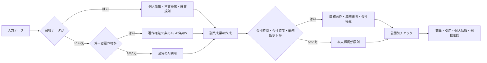

# B-1. ChatGPT Deep Research × 規制と海外事例

> 本ページは note 連載「副業サラリーマンのためのAI使い分けマップ」第2話【エージェント編】の取材レポート全文です。
> 一次出力をベースに、ツール内部の引用記法 (`citeturn〇〇`) と機械的なエンティティタグ (`entity[...]`) のみ平文化しています。本文・数値・引用URLは取材時のまま掲載しています。

---

# 副業会社員のAI業務効率化に関する国内法と社内規程の整理

## エグゼクティブサマリ

副業を持つ会社員がAIで効率化するときの主要リスクは、著作権侵害そのものよりも、**会社データの投入、秘密情報の越境共有、競業・労務管理、成果物の帰属、社内規程違反**の複合事故です。日本では、AI学習一般は著作権法30条の4で広く許容され得ますが、**享受目的の併存**や**RAGでの軽微利用超過**、**著作権者の利益を不当に害する場合**は別です。副業禁止は全面自由化ではなく、競業・秘密保持・長時間労働・信用毀損の合理的範囲で制限されます。個人情報は、委託型か第三者提供か、海外移転か、学習再利用の有無で結論が変わります。2024–2026年の実務では、文化庁、個人情報保護委員会、厚生労働省、経済産業省・総務省の原典を先に当たるのが最短です。

## 全体像

会社員の副業でAIを使うときは、まず「**何を入力するか**」、次に「**誰の成果になるか**」、最後に「**どこへ公開・提供するか**」の順で見ると整理しやすいです。日本の実務では、著作権法30条の4・47条の5、労働契約法3条、特許法35条、個人情報保護法18・20・23・25・27・28条周辺と、就業規則・副業規程・情報セキュリティ規程・発明規程・AI利用規程が重なって効きます。特に、会社の顧客データや未公表資料を外部AIへ入れる場面は、**法令違反と社内規程違反が同時に発生しやすい**ため、最優先の確認点です。

## 論点五つ

**論点A　AI学習・RAGに使う著作物の扱い**  
条文は著作権法30条の4、47条の5です。2024年3月15日の文化庁整理は、**AI学習のための情報解析は原則として30条の4の「非享受目的」側に乗り得る**一方、利用行為に一つでも「享受」目的が混ざれば同条の要件を欠くと示しました。さらに、RAGは、ベクトルDB作成自体が30条の4に乗り得ても、回答生成段階で既存著作物の創作的表現を出す目的なら外れ、47条の5も**「軽微利用」「付随」**を超えると使えません。文化庁は同文書で、生成AIと著作権を直接扱う判例・裁判例はなお乏しいとも整理しています。したがって、副業での実務基準は「学習だから安全」ではなく、**入力目的・出力態様・原文再現度**で切るべきです。条文番号は30条の4、47条の5。判例番号は、直接の国内主要AI判例がなお蓄積途上です。

**論点B　AI生成物を副業成果として公開するときの著作権と帰属**  
副業でAIに下書きを作らせ、あとで人が直す場合、争点は「侵害」と「誰の著作物か」です。著作権侵害の一般論では、文化庁整理が**類似性・依拠性**を軸に据え、特定作品群の創作的表現を意図的に再現させる追加学習や出力は侵害に向かうとしています。帰属面では、最近の東京地方裁判所令和5(ワ)70325が、動画等を会社・協会の業務として代表者や従業員が職務上作成し、会社等の名義で公表した事情を重視して職務著作を認めています。また、知的財産高等裁判所令和6(ネ)10079でも職務著作性が主要争点になりました。副業用のプロンプト、マクロ、解説文、社内改善フローは、特許法35条より前に、**著作権法15条の職務著作、就業規則、秘密情報管理**で会社帰属になることが多い、というのが実務上の読み筋です。条文番号は著作権法15条・23条、特許法35条。判例番号は令和5(ワ)70325、令和6(ネ)10079。

**論点C　副業時の競業避止義務・長時間労働・社内規程**  
日本法は「副業全面自由」でも「会社が自由に全面禁止」でもありません。厚生労働省の副業・兼業ページは、会社が留意すべき合理的制限事由として、**労務提供上の支障、企業秘密漏えい、競業、自社の名誉・信用の毀損、信頼関係破壊**を挙げています。モデル就業規則も、かつての包括的な兼業禁止規定を削除し、副業規定を新設しました。他方、労働契約法3条4・5は信義誠実と権利濫用禁止を定め、同条3項は仕事と生活の調和も要請します。裁判例では、東京地方裁判所平成22(ワ)732（アメリカン・ライフ競業避止義務）が労働事件として公式掲載され、名古屋高等裁判所平成1(ネ)386は、退職金不支給が許されるのは顕著な背信性がある場合に限るとしました。さらに、最高裁判所昭和44(オ)250は競業禁止契約の有効性を民法90条で判断しています。AI副業では、**本業顧客を副業AIツールに誘導する行為**が最も危険です。条文番号は労働契約法3条、労働基準法38条1項、民法90条。判例番号は平成22(ワ)732、平成1(ネ)386、昭和44(オ)250。

**論点D　職務発明的扱いと、会社AI改善ノウハウの帰属**  
「副業で作ったAI活用ノウハウは全部自分のもの」とは言えません。特許法35条が真正面から効くのは**発明**に当たる場合で、最高裁平成13(受)1256（オリンパス事件）は、勤務規則上の対価が相当対価に満たなければ不足額請求ができると示しました。逆に言えば、会社が定める発明規程・報奨規程は無意味ではなく、承継と対価設計の中心です。ただし、AIプロンプト集、社内向け自動化テンプレート、評価ワークフロー、FAQ整備などは、発明というより**職務著作、営業秘密、会社のノウハウ**として処理されることが多い。営業用顧客情報の持出しや退職後利用については、平成22年10月21日判決の裁判例PDFでも、顧客情報へのアクセス管理と競業避止の合理性が詳細に検討されています。実務では、**会社PC・会社アカウント・勤務時間・上司指示**のいずれかが濃いほど、本人帰属の主張は弱くなります。条文番号は特許法35条、著作権法15条、不正競争防止法2条6項周辺。判例番号は平成13(受)1256。

**論点E　顧客データをChatGPT等APIに送る場合と海外規制動向**  
個人情報保護法では、まず18条の**利用目的内か**、20条の**要配慮個人情報か**、23条・25条の**安全管理・委託先監督**、27条5項1号の**委託なら第三者提供に当たらないか**、28条の**外国第三者提供**が中核です。個人情報保護委員会Q&Aは、クラウド事業者が個人データを取り扱わない設計なら「第三者」に当たらないとし、委託の場合でも監督義務を課します。逆に、ベンダーが自社目的で入力を再利用する契約なら、単なる委託に収まらず27条・28条の検討が強く必要になります。PPCのOpenAI向け注意喚起も、要配慮個人情報の無断取得回避と利用目的通知を重視しました。海外では、欧州連合AI Actが雇用・労務管理・自営就業へのアクセスに使うAIを高リスク類型と位置づけ、データガバナンスやリスク管理を要求しています。米国でも、コロラド州SB24-205が2026年から雇用等の「consequential decision」を含む高リスクAIに対応し、カリフォルニア州は2024年から非競業条項の無効を再強化、ニューヨーク州労働法201-dはオフ勤務時間の一定活動を保護しつつ、利益相反例外を置き、ニューヨーク市LL144は採用AIにバイアス監査と通知を要求しています。

## リスクマトリクス

以下の表は、本報告の法令・判例・行政ガイドラインをもとに、**会社員の副業×AI利用**で事故に発展しやすい項目を重大度と発生頻度で配置したものです。特に、会社データの外部AI入力、営業秘密の持出し、競業、RAGの軽微利用超過、海外ベンダー利用時の個人情報論点を反映しています。

| 重大度＼発生頻度 | 高頻度 | 低頻度 |
|---|---|---|
| **高重大度** | **顧客・従業員データをそのまま外部AIへ入力**／**未公開資料・営業秘密の入力**／**未承認の外部AI利用による規程違反** | **本業顧客の副業転用・競業**／**退職金不利益・懲戒**／**成果物の会社帰属紛争** |
| **低重大度** | **RAGで原文を長く返してしまう**／**AI生成記事の引用不備**／**類似性確認不足による炎上** | **EU・米州の雇用AI規制の見落とし**／**海外移転時の説明不足**／**副業申請書の記載不足** |

## 実務チェックリストと参考原典

実務では、次の順番で確認すると事故率が下がります。第一に、**入力前**に「個人情報・要配慮個人情報・営業秘密・第三者著作物・未公開情報」が含まれていないかを分けること。第二に、ベンダーとの関係が**委託**か**第三者提供**か、かつ海外移転を伴うかを確認すること。第三に、RAGや要約で他人の文章を使う場合は、**軽微利用・付随性・原文再現の程度**を確認すること。第四に、副業先が本業の取引先・競合・同一市場かを副業申請で明示すること。第五に、会社PC、会社アカウント、勤務時間、会社指示の有無を証拠化し、成果帰属を曖昧にしないこと。第六に、公開前に類似検索と引用チェックを行うことです。

条文の「短い読み替え」を置くと、非専門家でも判断しやすくなります。著作権法30条の4は「**楽しむためでない情報解析なら原則可、ただし市場を不当に害すれば不可**」、47条の5は「**検索・情報処理に伴う軽い利用だけ**」、労働契約法3条4・5は「**信義誠実と権利濫用禁止**」、特許法35条は「**職務発明の承継と相当利益**」、個人情報保護法18・20・23・25・27・28条は「**利用目的内で、安全に、委託か第三者提供か、海外かを分けて考える**」です。

参考原典は次の順で当たると早いです。  
- 文化庁「AIと著作権に関する考え方について」（2024年3月15日）。AI学習、RAG、軽微利用、依拠性・類似性の現時点整理。  
- 個人情報保護委員会「生成AIサービスの利用に関する注意喚起等」およびOpenAI向け注意喚起概要、通則編Q&A。委託・第三者提供・要配慮個人情報・クラウドの論点。  
- 厚生労働省「副業・兼業の促進に関するガイドライン」「モデル就業規則」「労働契約法のあらまし」。副業制限の合理事由、仕事と生活の調和、信義誠実、兼業規程。  
- 経済産業省・総務省「AI事業者ガイドライン」第1.0版（2024）と第1.2版（2026）。社内AIガバナンスと利用者向け統制。  
- 裁判所の原典。職務発明は平成13(受)1256、競業と退職金は平成22(ワ)732・平成1(ネ)386・昭和44(オ)250、最近の職務著作論点は令和5(ワ)70325・令和6(ネ)10079。  
- 海外比較はEU AI Act、Colorado SB24-205、California BPC 16600周辺、New York Labor Law 201-d、NYC LL144。

## 残る不確実性と確認先

最大の不確実性は、**日本で生成AIと著作権を真正面から扱う確立判例がまだ十分にないこと**です。文化庁自身が2024年文書で判例・裁判例の乏しさを明記しており、2024–2026の更新は主として行政整理と周辺裁判例の蓄積です。したがって、30条の4に乗るか、RAGが47条の5の「軽微利用」に収まるか、AI生成物の依拠性があるかは、最終的には個別事実で変わります。

次に不確実なのは、**AIベンダーの利用規約・学習再利用設定・保存場所が変わり得ること**です。法律論が同じでも、契約が「委託型」か「独自利用あり」かで27条・28条の結論は変わります。ここは、会社の法務、個人情報保護責任者、情報セキュリティ部門、必要に応じて外部の弁護士・弁理士に、①利用規約、②DPA、③学習オプトアウト、④保存国、⑤監査ログの有無を確認すべきです。

最後に、副業の可否は一般論では決まりません。**本業との顧客重複、市場の近さ、就業規則上の申請義務、会社資産の使用、労働時間通算**でほぼ結論が変わるからです。確認先は、第一に自社の就業規則・副業規程・発明規程・情報セキュリティ規程、第二にHR、第三に法務、第四に個人情報・知財の外部専門家です。規制産業、医療、金融、公共系、受託開発では、業法や委託契約上の追加制約が入る点も注記しておくべきです。
---

[← 第2話 補足ノートのインデックスに戻る](./)

[← シリーズ全体のインデックスに戻る](../)
