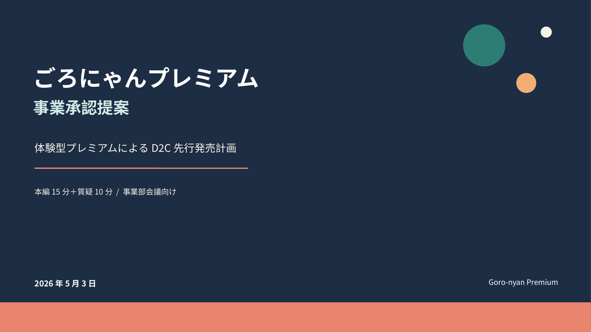
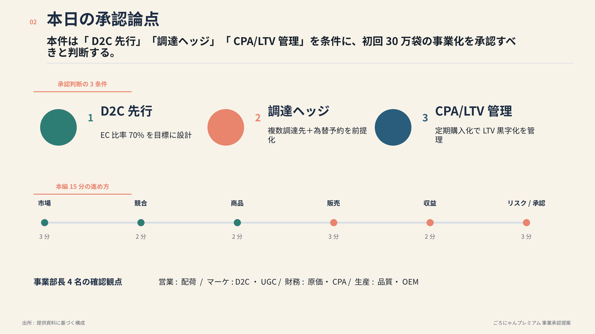
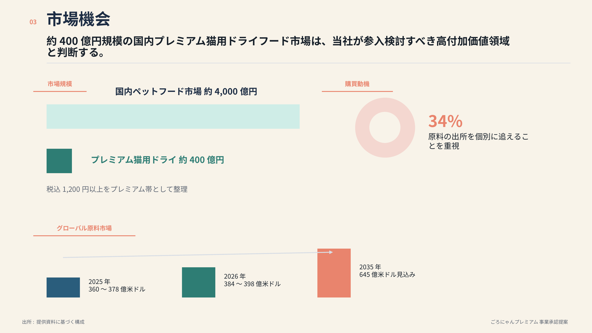
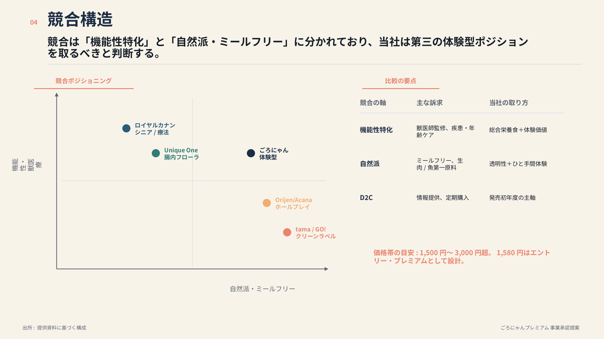
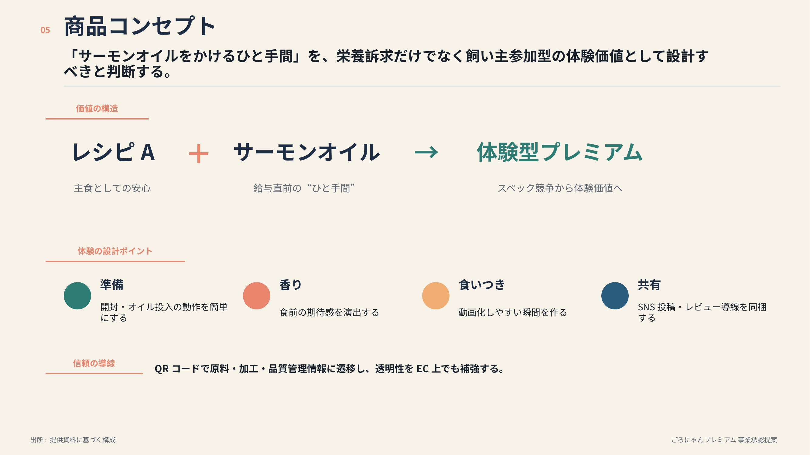
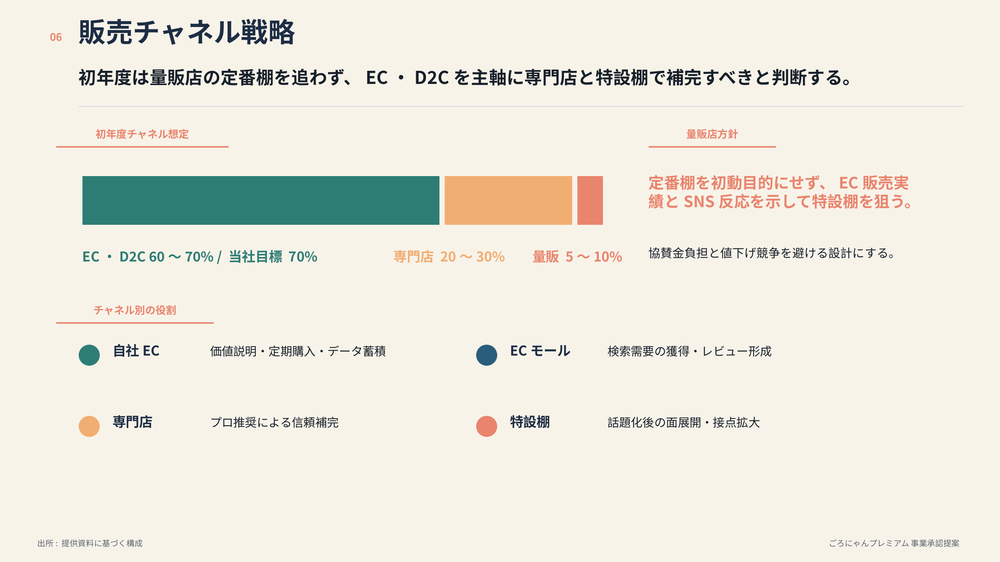
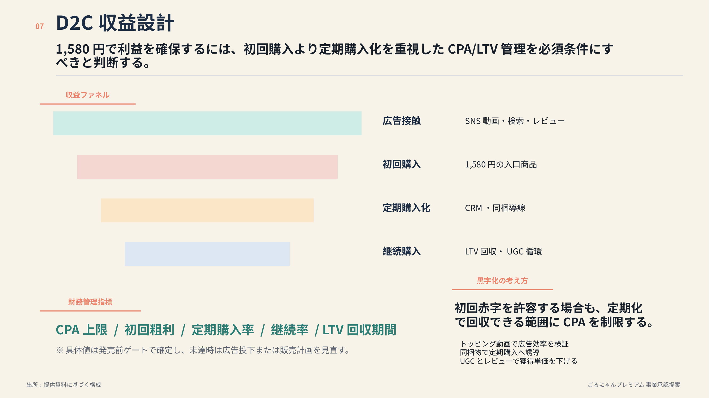
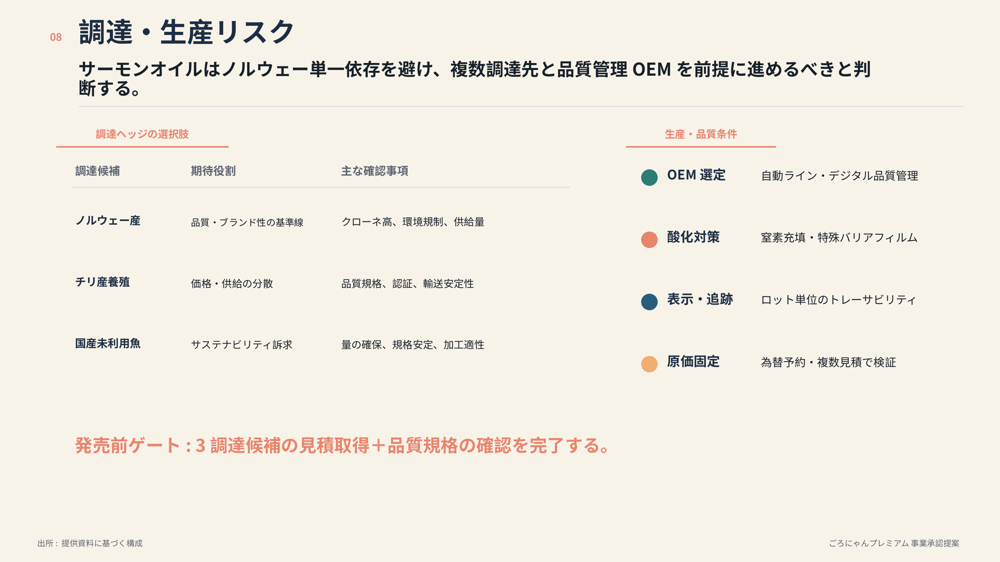
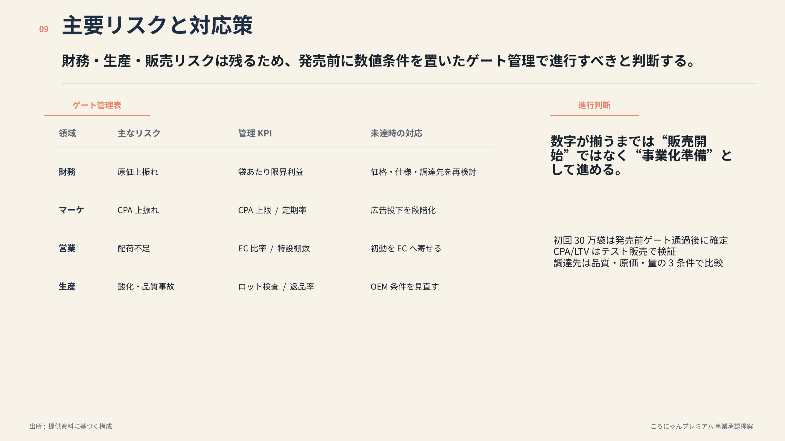
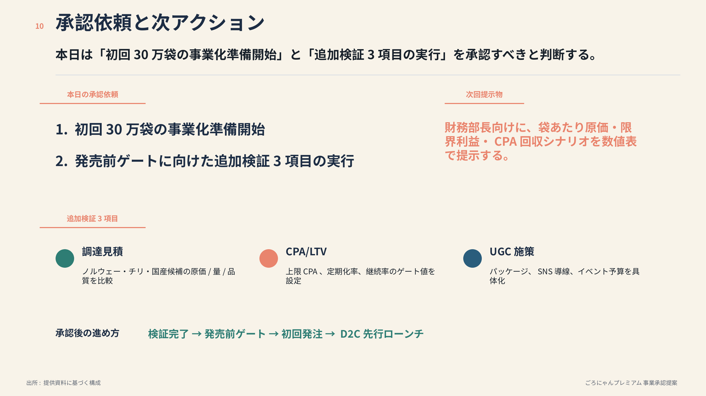

# W2-3. ChatGPT が生成したサンプルスライド

note 連載「副業サラリーマンのためのAI使い分けマップ」第3話【ワークフロー編】の **W2 リサーチ→資料化** ワークフローで、ChatGPT が実際に生成したスライド成果物です。

W2-3 のステップで、市場リサーチ + NotebookLM 想定問答を投入したあと、ChatGPT に「このまま 10 スライドの PowerPoint にしてください」と頼んだ結果、構成案の Markdown だけでなく **実物の `.pptx` ファイルと10枚のスライド画像** までが生成されました。本ページではその一式を掲載しています。

題材は、シリーズで継続使用している架空のキャットフードメーカー「ごろにゃんプレミアム」の事業承認会議向け資料です。

## ダウンロード

- [`goronyan_premium_business_approval.pptx` (325KB)](./goronyan_premium_business_approval.pptx) — 編集可能な PowerPoint ファイル

## 10 スライド画像 (プレビュー)

各スライドのサムネイルです。クリックで拡大できます。

### スライド1 — 表紙

### スライド2 — 市場概観

### スライド3 — 競合動向

### スライド4 — 自社ポジション

### スライド5 — 製品仕様

### スライド6 — 価格と原価

### スライド7 — 流通とチャネル

### スライド8 — リスクと対応

### スライド9 — ロードマップ

### スライド10 — まとめ

## 補足

- スライドのタイトル割当は推測です (note 本編で扱った 10 スライド構成案と一致するように並べていますが、ChatGPT の出力次第で章順や見出しは多少変わります)。
- 実 pptx は ChatGPT の Code Interpreter / 高度なデータ分析機能を使って python-pptx でレンダリングされたものです。フォント埋め込みやスライドマスターの細かい調整は手元で行う前提です。
- 本ページのスライド画像は ChatGPT 生成のままで、個人情報やプロジェクト固有名詞は含まれていません (架空のキャットフード会社の例題)。

---

[← 第3話 補足ノートのインデックスに戻る](../)

[← シリーズ全体のインデックスに戻る](../../)
